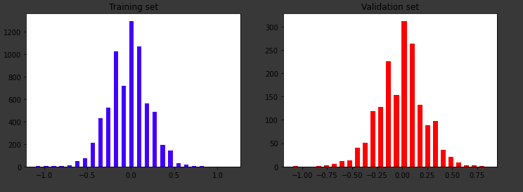

# Behavioral_cloning (Nvdia autonomous driving)
## This project is an implementation of autonomous driving experimented my nvdia using standard techniques in DeepLearning
# Overview
### DATASET- 
#### Captured images for complete 360 degree of various conditions on a simulator.
### NEURAL NETWORK-
#### Trained an CNN network with image augmentation flow using openCV.
# Algorithm in action

### Details:
##### Data distribution

#### After augmentation flow

